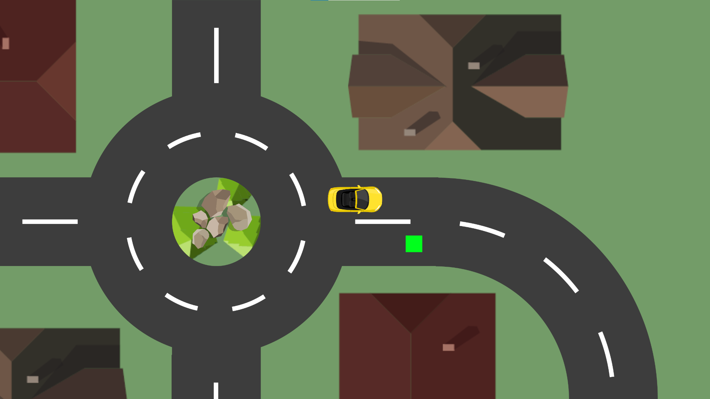
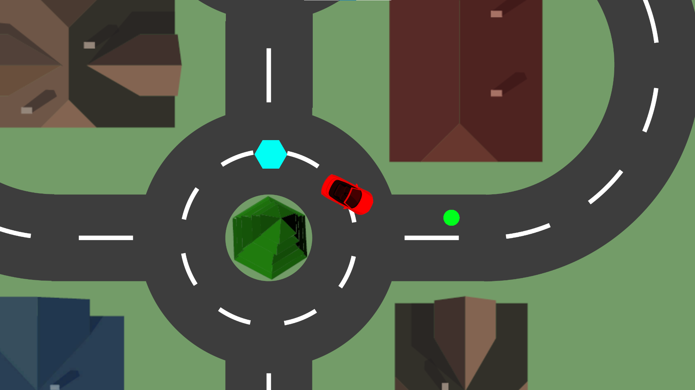

# Delivery Driver

## Descrição
Projeto feito para teste das capacidades básicas da engine de Unity, um esqueleto de um jogo de direção simples.

## Capturas de Tela
Inclua algumas capturas de tela do jogo para dar aos usuários uma ideia visual do que esperar.

## Instalação padrão

1. Faça download dos arquivos [neste link](https://pixeldrain.com/u/CzZvbQGH).
2. Extraia em alguma pasta de sua escolha.
3. Execute Delivery Driver.exe

## Instalação por compilação
Descreva como os usuários podem instalar e executar o jogo em seus sistemas.

1. Clone este repositório: `git clone https://github.com/Selbstverlust/Delivery-Driver.git`
2. Abra o projeto no Unity.
3. Configure as configurações de build para a plataforma desejada (por exemplo, Windows, macOS, Android, etc.).
4. Compile e execute o jogo.

## Controles
Forneça informações sobre como jogar o jogo, incluindo os controles básicos.

- **W**: Mover para frente
- **A**: Virar para a esquerda
- **S**: Mover para trás
- **D**: Virar para a direita

## Créditos
Toda a arte do jogo é do direito autoral da Equipe de [GameDev.tv](https://www.gamedev.tv/).
